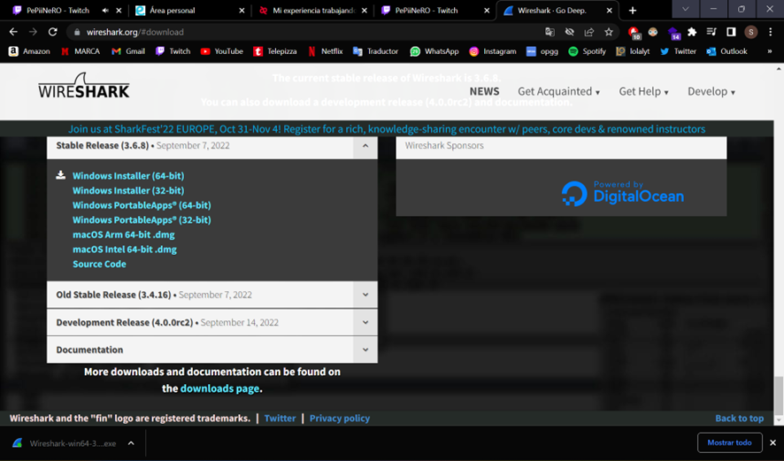
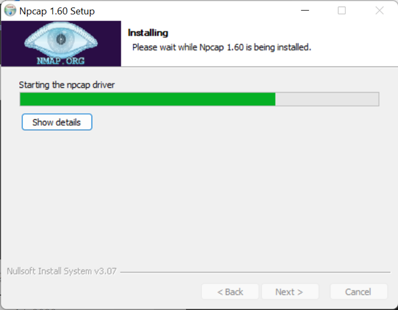
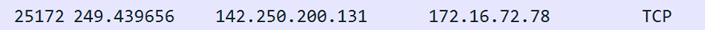

#### *1. Crea un repositorio para subir todas las actividades de esta asignatura con el nombre despliegue-de-aplicaciones-web.*

#### *2. Crea una carpeta en tu repositorio llamada “Actividad 1” y dentro crea un archivo README.md con la solución a los siguientes ejercicios.*

#### *3. Analiza los headers de las peticiones cuando inicias sesión en el Moodle y comprende cómo se obtiene el token. Para ello, necesitamos saber de dónde salen TODOS los datos sensibles que se envían.*

Inspeccionamos la página web, nos vamos a network, hacemos click sobre el primer header, y allí le damos a payload, donde podremos ver nuestro token. El token se genera automáticamente cuando estamos encima del formulario donde se nos pide usuario y contraseñan, ese token es la sesión actual, el cliente va enviando el token al servidor para que siga funcionando, si estas sin hacer nada el cliente no enviara el token al servidor.

#### *4. ¿A qué puerto se reciben normalmente las peticiones del protocolo HTTP? ¿A qué capa del modelo TCP/IP se encuentra el protocolo HTTP? ¿Y los protocolos TCP, UDP, e IP?*
   En TCP el puerto por defecto, para un servidor HTTP en un computador, es el puerto 80. Se pueden usar otros puertos como el 8000 o el 8080

En esta capa es donde encontramos algunos protocolos muy famosos como son el HTTP de las páginas web, el FTP para la transferencia de archivos, DHCP como protocolo de configuración dinámica de host o el SMTP para la transferencia de correos. Corresponde a las capas 5, 6 y 7 del modelo OSI.

- TCP, en la capa 1. 
- UDP, en la capa 3.
- IP, en la capa 1 y 2.

#### *5. ¿Cuál es el significado de la siguiente respuesta de un servidor? HTTP/1.1 302 Found Location: http://www.example.com/test/index2.php*

Un código de estado HTTP que comienza con "3" indica que su navegador web debe realizar más acciones para cumplir con la solicitud.

El error HTTP 302 ocurre cuando el recurso solicitado se ha movido temporalmente a una nueva ubicación. Por lo tanto, el sistema redirige automáticamente a los visitantes a una nueva URL que tenga el recurso.

#### *6. Utilizando el filtro de captura para la interfaz de red de Wireshark, analiza la petición al host: www.google.com. Mostrando la cabecera IP, la dirección IP de tu ordenador y la del servidor. Comprueba que, poniendo esa IP en el navegador, accedas a Google.*

He podido entrar en Google desde esa IP, 142.250.200.131

